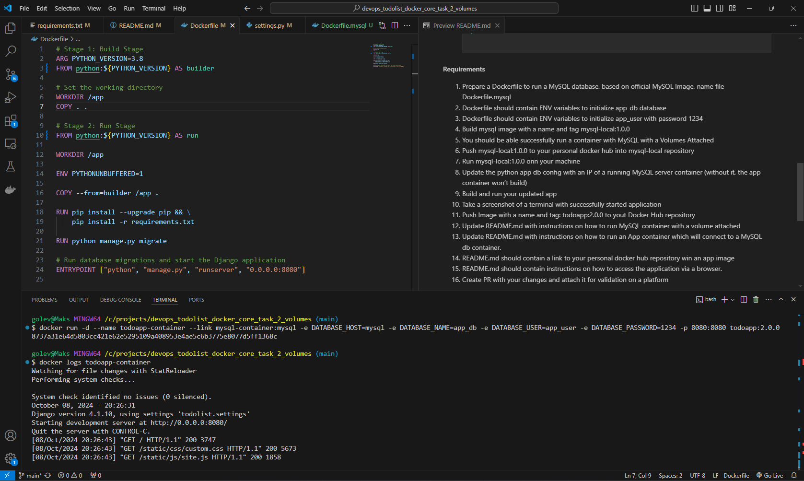

# Django-Todolist

Django-Todolist is a todolist web application with the most basic features of most web apps, i.e. accounts/login, API and (somewhat) interactive UI.

---
CSS | [Skeleton](http://getskeleton.com/)
JS  | [jQuery](https://jquery.com/)

## Explore
Try it out by installing the requirements. (Works only with python >= 3.8, due to Django 4)

    pip install -r requirements.txt

Create a database schema:

    python manage.py migrate

And then start the server (default: http://localhost:8000)

    python manage.py runserver


Now you can browse the [API](http://localhost:8000/api/)
or start on the [landing page](http://localhost:8000/)

## Task
#### Prerequisites
- Fork this repository
- Open requirements.txt
- Add mysql-connector-python==8.2.0
- Open file todolist/settings.py
- Go to line DATABASES on line 64
- Update it with this code:

    ```
    DATABASES = {
        'default': {
            'ENGINE': 'mysql.connector.django',
            'NAME': 'app_db',
            'USER': 'app_user',
            'PASSWORD': '1234',
            'HOST': 'localhost',  # You can use a different host in your MySQL server is on a remote machine.
            'PORT': '',  # Leave this empty to use the default MySQL port (3306).
        }
    }

    ```
#### Requirements
1. Prepare a Dockerfile to run a MySQL database, based on official MySQL Image, name file Dockerfile.mysql
2. Dockerfile should contain ENV variables to initialize app_db database
3. Dockerfile should contain ENV variables to initialize app_user with password 1234
4. Build mysql image with a name and tag mysql-local:1.0.0
5. You should be able successfully run a container with MySQL with a Volumes Attached
6. Push mysql-local:1.0.0 to your personal docker hub into mysql-local repository
7. Run mysql-local:1.0.0 onn your machine
8. Update the python app db config with an IP of a running MySQL server container (without it, the app container won’t build)
9. Build and run your updated app
10. Take a screenshot of a terminal with successfully started application
11. Push Image with a name and tag: todoapp:2.0.0 to yout Docker Hub repository
12. Update README.md with instructions on how to run MySQL container with a volume attached
13. Update README.md with instructions on how to run an App container which will connect to a MySQL db container.
14. README.md should contain a link to your personal docker hub repository win an app image
15. README.md should contain instructions on how to access the application via a browser.
16. Create PR with your changes and attach it for validation on a platform

## How to Start

### Plan:

#### 1. Build the MySQL Image

This step builds the custom MySQL image using your Dockerfile.mysql.
```docker
docker build -t mysql-local:1.0.0 -f Dockerfile.mysql .
```
#### 2. Run MySQL Container with Attached Volume

This command runs the MySQL container and attaches a named volume for persistent data storage.
```docker
docker run -d --name mysql-container -v mysql_data:/var/lib/mysql -e MYSQL_ROOT_PASSWORD=root_password mysql-local:1.0.0
```
#### 3. Get MySQL Container IP Address

To link the Python app with MySQL, you need to find the IP address of the running MySQL container. You can do this in two ways:

**Method 1**: Inspect the container directly:
```docker
docker inspect -f '{{range .NetworkSettings.Networks}}{{.IPAddress}}{{end}}' mysql-container
```
**Method 2**: Inspect the Docker network:
```docker
docker network inspect bridge
```
Look for the "Name": "<mysql_container_name>", and below it, find "IPv4Address": "<your_ip>/16".

#### 4. Update Python Application Configuration

Update your application configuration file (e.g., .env or settings.py) by replacing localhost with the IP address of the MySQL container:
and replese <*localhost> on <your_ip>
```docker
DATABASE_HOST=<your_ip>
DATABASE_NAME=app_db
DATABASE_USER=app_user
DATABASE_PASSWORD=1234
DATABASE_PORT=3306
```
#### 5. Build and Run the Updated Python Application

After updating the configuration, build your Python app image:
```docker
docker build -t todoapp:2.0.0 .
```
Then run the Python app, linking it to the MySQL container:
```
docker run -d --name todoapp-container --link mysql-container:mysql -p 8080:8080 todoapp:2.0.0
```
#### 6. Access the Application
Once the containers are up, you can access your application in a browser at: [http://localhost:8080](localhost:8080)


### Links:

* [MySQL Image on Docker Hub](https://hub.docker.com/repository/docker/maks2531/mysql-local/general)

* [TodoApp Image on Docker Hub](https://hub.docker.com/repository/docker/maks2531/todoapp/general)
